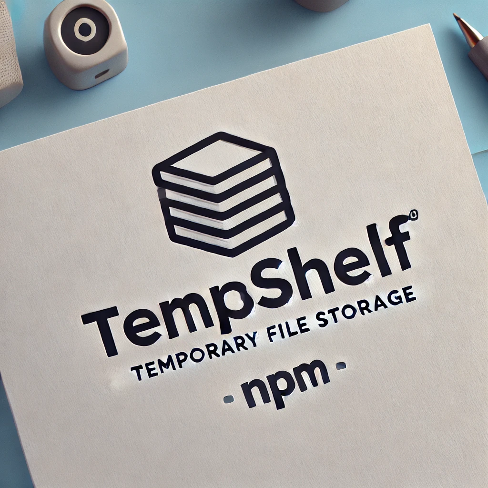
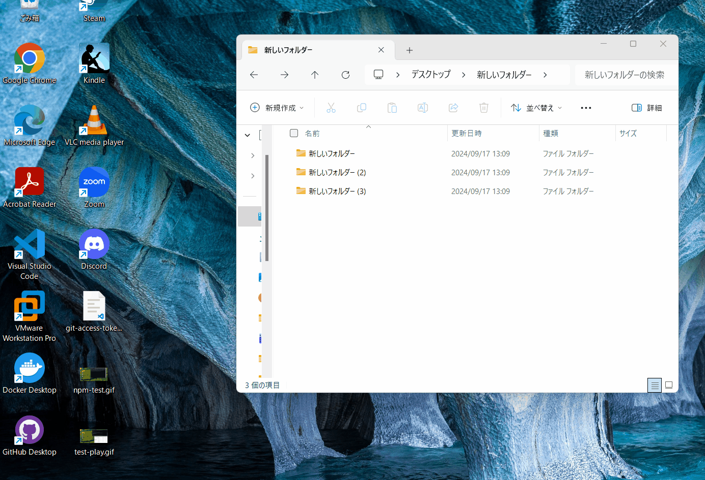

<h2 align="center">Temporary File Storage</h2>

<p align="center">
<a href="https://github.com/kazuma-naka/temp-shelf/blob/main/LICENSE">

</a>
<a href="https://www.npmjs.com/package/temp-shelf">

</a>
<a href="https://github.com/kazuma-naka/temp-shelf/actions/workflows/build.yml">

</a>
<a href="https://github.com/kazuma-naka/temp-shelf/actions/workflows/test.yml">

</a>
<a href="https://github.com/prettier/prettier">

</a>


</p>

## Table of contents

- [Intro](#temp-shelf)
- [Installation](#Installation)
- [Features](#Features)
- [Quick Start](#Quick-Start)
- [紹介](#紹介)
- [インストール](#インストール)
- [機能](#機能)
- [クイックスタート](#クイックスタート)
- [License](#license)
- [Used Icons](#icons)



# temp-shelf

temp-shelf is a lightweight utility designed to temporarily store file paths, providing quick access and easy retrieval during drag-and-drop operations. It simplifies file handling without duplicating or managing clipboard history, making it ideal for quick file transfers across apps.

## Installation

```bash
npm install temp-shelf
```

or [Download binary files from here](https://github.com/kazuma-naka/temp-shelf/releases)

## Features

- **Temporary File Storage**: Store file paths temporarily for quick access without duplicating files.
- **Drag-and-Drop Support**: Seamless drag-and-drop integration for file paths across your apps and OS.
- **Lightweight Design**: Focuses on efficient temporary file storage without managing clipboard or background tasks.
- **Electron-Powered**: Built with Electron, providing cross-platform support (Windows, macOS, Linux).

## Quick Start

Start the app:

```bash
npx temp-shelf
```

---

# 紹介

temp-shelf は、ファイルパスを一時的に保存し、ドラッグ＆ドロップ操作中に素早くアクセス・取得できる軽量なユーティリティです。ファイルの複製やクリップボード履歴の管理を行わないため、アプリ間の素早いファイル転送に最適です。

## インストール

```bash
npm install temp-shelf
```

もしくは [ここからバイナリファイルをダウンロードする](https://github.com/kazuma-naka/temp-shelf/releases)

## 機能

- **一時的なファイル保存**: ファイルパスを一時的に保存し、簡単にアクセス可能にします。ファイルの複製は行いません。
- **ドラッグ＆ドロップサポート**: OS やアプリ間でファイルパスのシームレスなドラッグ＆ドロップ操作をサポート。
- **軽量設計**: クリップボードやバックグラウンドタスクの管理を行わず、効率的に一時ファイルを保存。
- **Electron ベース**: Electron で構築されており、Windows、macOS、Linux のクロスプラットフォームに対応。

## クイックスタート

アプリの起動:

```bash
npx temp-shelf
```

---

## License

[MIT](LICENSE)

## Icons

<a href="https://www.flaticon.com/free-icons/css" title="css icons">Css icons created by Smashicons - Flaticon</a>

<a href="https://www.flaticon.com/free-icons/file-format" title="file format icons">File format icons created by shohanur.rahman13 - Flaticon</a>

<a href="https://www.flaticon.com/free-icons/avi" title="avi icons">Avi icons created by Hilmy Abiyyu A. - Flaticon</a>

<a href="https://www.flaticon.com/free-icons/files-and-folders" title="files and folders icons">Files and folders icons created by Freepik - Flaticon</a>

<a href="https://www.flaticon.com/free-icons/bzip2" title="bzip2 icons">Bzip2 icons created by JunGSa - Flaticon</a>

<a href="https://www.flaticon.com/free-icons/default" title="default icons">Default icons created by Septiana Faza - Flaticon</a>

<a href="https://www.flaticon.com/free-icons/gif" title="gif icons">Gif icons created by Dimitry Miroliubov - Flaticon</a>

<a href="https://www.flaticon.com/free-icons/gzip" title="gzip icons">Gzip icons created by JunGSa - Flaticon</a>

<a href="https://www.flaticon.com/free-icons/html" title="html icons">Html icons created by Freepik - Flaticon</a>

<a href="https://www.flaticon.com/free-icons/js" title="js icons">Js icons created by iconixar - Flaticon</a>

<a href="https://www.flaticon.com/free-icons/json-file" title="json file icons">Json file icons created by Smashicons - Flaticon</a>

<a href="https://www.flaticon.com/free-icons/file-extension" title="file extension icons">File extension icons created by iconixar - Flaticon</a>

<a href="https://www.flaticon.com/free-icons/mp4" title="mp4 icons">Mp4 icons created by Freepik - Flaticon</a>

<a href="https://www.flaticon.com/free-icons/odp-file-format" title="odp file format icons">Odp file format icons created by The Chohans - Flaticon</a>

<a href="https://www.flaticon.com/free-icons/ods-file" title="ods file icons">Ods file icons created by The Chohans - Flaticon</a>

<a href="https://www.flaticon.com/free-icons/odt" title="odt icons">Odt icons created by The Chohans - Flaticon</a>

<a href="https://www.flaticon.com/free-icons/files-and-folders" title="files and folders icons">Files and folders icons created by Shuvo.Das - Flaticon</a>

<a href="https://www.flaticon.com/free-icons/open-folder" title="open folder icons">Open folder icons created by kmg design - Flaticon</a>

<a href="https://www.flaticon.com/free-icons/pdf" title="pdf icons">Pdf icons created by Dimitry Miroliubov - Flaticon</a>

<a href="https://www.flaticon.com/free-icons/png" title="png icons">Png icons created by Dimitry Miroliubov - Flaticon</a>

<a href="https://www.flaticon.com/free-icons/office365" title="office365 icons">Office365 icons created by Tinti Nodarse - Flaticon</a>

<a href="https://www.flaticon.com/free-icons/rar-file" title="rar file icons">Rar file icons created by riajulislam - Flaticon</a>

<a href="https://www.flaticon.com/free-icons/svg" title="svg icons">Svg icons created by Dimitry Miroliubov - Flaticon</a>

<a href="https://www.flaticon.com/free-icons/tar-file" title="tar file icons">Tar file icons created by AomAm - Flaticon</a>

<a href="https://www.flaticon.com/free-icons/text" title="text icons">Text icons created by juicy_fish - Flaticon</a>

<a href="https://www.flaticon.com/free-icons/webp" title="webp icons">Webp icons created by yoorie - Flaticon</a>

<a href="https://www.flaticon.com/free-icons/word" title="word icons">Word icons created by Pixel perfect - Flaticon</a>

<a href="https://www.flaticon.com/free-icons/xml" title="xml icons">Xml icons created by Smashicons - Flaticon</a>

<a href="https://www.flaticon.com/free-icons/zip" title="zip icons">Zip icons created by Dimitry Miroliubov - Flaticon</a>

<a href="https://www.flaticon.com/free-icons/logos" title="logos icons">Logos icons created by pocike - Flaticon</a>

<a href="https://www.flaticon.com/free-icons/drag-and-drop" title="drag and drop icons">Drag and drop icons created by UIUX Mall - Flaticon</a>

<a href="https://www.flaticon.com/free-icons/ico" title="ico icons">Ico icons created by The Chohans - Flaticon</a>

<a href="https://www.flaticon.com/free-icons/icns" title="icns icons">Icns icons created by JunGSa - Flaticon</a>

<a href="https://www.flaticon.com/free-icons/files-and-folders" title="files and folders icons">Files and folders icons created by Shahryar MInhas - Flaticon</a>

<a href="https://www.flaticon.com/free-icons/deb" title="deb icons">Deb icons created by JunGSa - Flaticon</a>

<a href="https://www.flaticon.com/free-icons/rpm-file" title="rpm file icons">Rpm file icons created by The Chohans - Flaticon</a>

<a href="https://www.flaticon.com/free-icons/sh" title="sh icons">Sh icons created by The Chohans - Flaticon</a>

<a href="https://www.flaticon.com/free-icons/csh" title="csh icons">Csh icons created by iconland_1 - Flaticon</a>

<a href="https://www.flaticon.com/free-icons/csv-file" title="csv file icons">Csv file icons created by juicy_fish - Flaticon</a>

<a href="https://www.flaticon.com/free-icons/file-extension" title="file extension icons">File extension icons created by bearicons - Flaticon</a>

<a href="https://www.flaticon.com/free-icons/python" title="python icons">Python icons created by Freepik - Flaticon</a>

<a href="https://www.flaticon.com/free-icons/coding" title="coding icons">Coding icons created by Freepik - Flaticon</a>

<a href="https://www.flaticon.com/free-icons/c-sharp" title="c sharp icons">C sharp icons created by Freepik - Flaticon</a>

<a href="https://www.flaticon.com/free-icons/md" title="md icons">Md icons created by JunGSa - Flaticon</a>

<a href="https://www.flaticon.com/free-icons/javascript" title="javascript icons">Javascript icons created by Smashicons - Flaticon</a>
